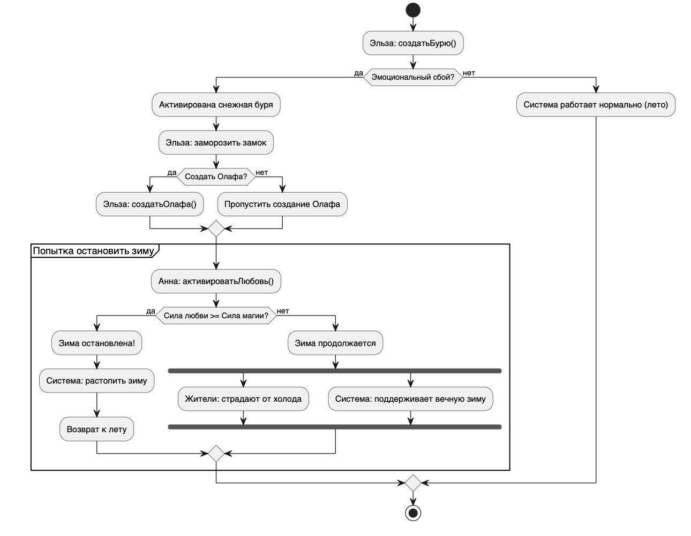

# Activity Diagram: Алгоритм системы "Холодное сердце"

## Обзор
Эта диаграмма активности показывает алгоритм работы системы "Холодное сердце" с точки зрения управления климатом и безопасности.

## Описание потока

### Шаг 1: Начало системы
- Эльза активирует магию и создаёт снежную бурю

### Шаг 2: Эмоциональный сбой
- Система проверяет состояние Эльзы  
- **Если есть сбой** — активируется снежная буря, замораживается замок  
- **Если нет** — система продолжает работу в штатном режиме (лето)

### Шаг 3: Создание Олафа
- Эльза может создать Олафа  
- **Если создание успешно** — Олаф появляется  
- **Если нет** — процесс продолжается без него  

### Шаг 4: Попытка остановки системы
- Анна пытается остановить зиму  
- Используется механизм: активироватьЛюбовь()

- **Если сила любви достаточна** — система восстанавливается, зима прекращается  
- **Если нет** — система остаётся в аварийном режиме (зима продолжается)

### Шаг 5: Последствия сбоя
- При неудаче запускаются параллельные процессы:
  - Жители страдают от холода  
  - Система поддерживает вечную зиму  

---

## Точки принятия решений

| Условие                          | Результат |
|----------------------------------|----------|
| Эмоциональный сбой               | Да → активация зимы / Нет → нормальный режим |
| Создание Олафа                   | Успех → создан / Неудача → пропуск |
| Сила любви ≥ Сила магии          | Успех → зима остановлена / Неудача → зима продолжается |

---

## Диаграмма


```plantuml
@startuml
skinparam conditionStyle inside
title Алгоритм системы "Холодное сердце" (Управление климатом и безопасность)

start

:Эльза активирует магию;
:Создать снежную бурю;

if (Эмоциональный сбой?) then (да)
    :Активирована снежная буря;
    :Эльза замораживает замок;

    if (Создать Олафа?) then (да)
        :Олаф создан;
    else (нет)
        :Система продолжает работу;
    endif

    if (Анна пытается остановить зиму?) then (да)
        :Анна: активироватьЛюбовь();
        if (Сила любви >= Сила магии?) then (да)
            :Зима остановлена; <<#lightgreen>>
            :Система возвращает лето;
        else (нет)
            :Зима продолжается;
            fork
                :Жители страдают от холода;
            fork again
                :Система поддерживает вечную зиму;
            end fork
        endif
    else (нет)
        :Зима продолжается;
    endif

else (нет)
    :Система работает нормально (лето);
endif

:Система завершила цикл работы; <<#lightgreen>>
stop

@enduml