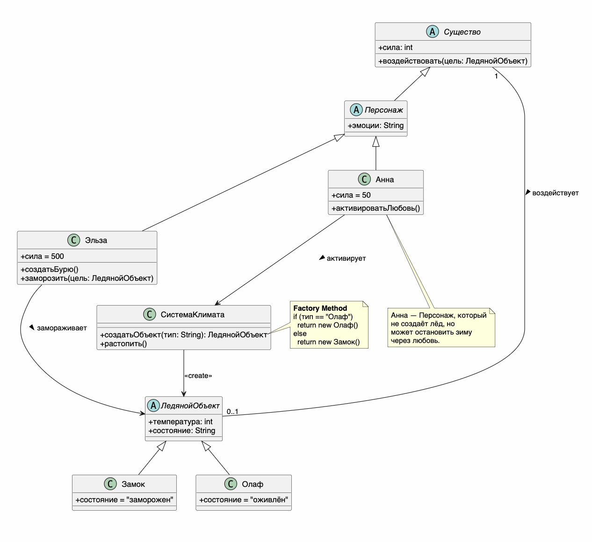

# Class Diagram: Холодное сердце

## Обзор
Эта диаграмма классов показывает объектно-ориентированную структуру системы "Холодное сердце" с акцентом на управление ледяными объектами и климатом.

## Иерархия классов
### Иерархия существ
| Class      | Type      | Attributes              | Methods                                   |
|------------|-----------|-------------------------|-------------------------------------------|
| Существо   | Abstract  | + сила: int             | + воздействовать(цель: ЛедянойОбъект)     |
| Персонаж   | Abstract  | + эмоции: String        | extends Существо                          |
| Эльза      | Concrete  | + сила = 500            | extends Персонаж, + создатьБурю(), + заморозить(цель) |
| Анна       | Concrete  | + сила = 50             | extends Персонаж, + активироватьЛюбовь()  |

### Иерархия объектов
| Class          | Type      | Attributes                        | Methods |
|----------------|-----------|-----------------------------------|--------|
| ЛедянойОбъект  | Abstract  | + температура: int, + состояние: String | - |
| Замок          | Concrete  | + состояние = "заморожен"         | extends ЛедянойОбъект |
| Олаф           | Concrete  | + состояние = "оживлён"           | extends ЛедянойОбъект |

### Система
| Class            | Type     | Attributes | Methods                                      |
|------------------|----------|------------|----------------------------------------------|
| СистемаКлимата   | Concrete | -          | + создатьОбъект(тип: String), + растопить()  |

## Связи
- **СистемаКлимата ..> ЛедянойОбъект**: создаёт (Factory Method)  
- **Эльза --> ЛедянойОбъект**: замораживает  
- **Анна --> СистемаКлимата**: активирует восстановление  
- **Существо "1" -- "0..1" ЛедянойОбъект**: воздействует  

## Шаблоны проектирования
### Фабричный метод
СистемаКлимата использует метод `создатьОбъект()` для создания ледяных объектов.  
В зависимости от параметра создаётся либо `Олаф`, либо `Замок`.

### Стратегия восстановления
Анна применяет метод `активироватьЛюбовь()` как механизм остановки зимы.  
Этот метод влияет на `СистемаКлимата`, вызывая процесс `растопить()`.

## Заметки
- **Эльза** — основной источник изменения состояния системы (создание и заморозка объектов)  
- **Анна** — единственный персонаж, способный остановить зиму  
- **СистемаКлимата** — управляет созданием и состоянием ледяных объектов  
- **Олаф** — единственный «живой» ледяной объект  
- Все ледяные сущности наследуются от `ЛедянойОбъект`  

## Диаграмма


```plantuml
@startuml
skinparam classAttributeIconSize 0

' --- Иерархия существ ---
abstract class Существо {
    + сила: int
    + воздействовать(цель: ЛедянойОбъект)
}

abstract class Персонаж extends Существо {
    + эмоции: String
}

class Эльза extends Персонаж {
    + сила = 500
    + создатьБурю()
    + заморозить(цель: ЛедянойОбъект)
}

class Анна extends Персонаж {
    + сила = 50
    + активироватьЛюбовь()
}

' --- Иерархия объектов ---
abstract class ЛедянойОбъект {
    + температура: int
    + состояние: String
}

class Замок extends ЛедянойОбъект {
    + состояние = "заморожен"
}

class Олаф extends ЛедянойОбъект {
    + состояние = "оживлён"
}

' --- Контроллер/Фабрика ---
class СистемаКлимата {
    + создатьОбъект(тип: String): ЛедянойОбъект
    + растопить()
}

' СВЯЗИ
СистемаКлимата ..> ЛедянойОбъект : <<create>>
Эльза --> ЛедянойОбъект : замораживает >
Анна --> СистемаКлимата : активирует >
Существо "1" -- "0..1" ЛедянойОбъект : воздействует >

note right of СистемаКлимата::создатьОбъект
  **Factory Method**
  if (тип == "Олаф") 
    return new Олаф()
  else 
    return new Замок()
end note

note bottom of Анна
  Анна — Персонаж, который
  не создаёт лёд, но
  может остановить зиму
  через любовь.
end note

@enduml