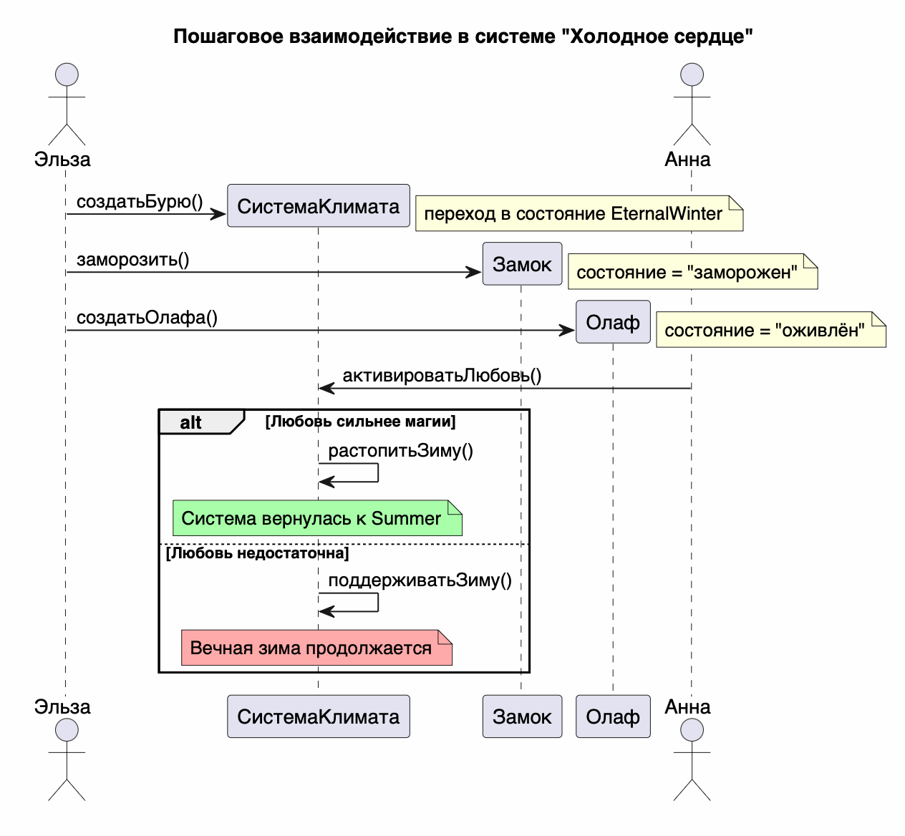

# Sequence Diagram: Взаимодействие в системе "Холодное сердце"

## Обзор
Эта диаграмма последовательности показывает пошаговое взаимодействие между персонажами и системой в "Холодное сердце" с точки зрения управления климатом и обработки сбоев.

## Актеры и участники
| Актер/Участник | Описание |
|----------------|----------|
| Эльза          | Главный источник магии, вызывает `создатьБурю()` и `заморозить()` |
| СистемаКлимата | Управляет состоянием климата |
| Замок          | Ледяной объект, подвергается заморозке |
| Олаф           | Ледяной объект, создаётся системой |
| Анна           | Персонаж, пытается остановить зиму через `активироватьЛюбовь()` |

## Interaction Steps

### Шаг 1: Запуск системы
- Эльза вызывает метод `создатьБурю()`
- Система переходит в состояние вечной зимы

### Шаг 2: Заморозка замка
- Эльза вызывает `заморозить()`
- Замок переходит в состояние "заморожен"

### Шаг 3: Создание Олафа
- Эльза вызывает `создатьОлафа()`
- Олаф создаётся и получает состояние "оживлён"

### Шаг 4: Попытка остановить зиму (критический момент)
- Анна вызывает метод `активироватьЛюбовь()`
- Система проверяет соотношение силы любви и магии

- **Если любовь сильнее магии**:
  - Система вызывает `растопитьЗиму()`
  - Состояние меняется на лето

- **Если нет**:
  - Система вызывает `поддерживатьЗиму()`
  - Вечная зима продолжается

## Ключевые наблюдения
1. Эльза инициирует переход системы в состояние зимы через `создатьБурю()`
2. Заморозка объектов происходит через метод `заморозить()`
3. Олаф — единственный объект, который создаётся как "оживлённый"
4. Анна — единственный персонаж, способный изменить состояние системы
5. Итог системы зависит от соотношения силы любви и магии

## Диаграмма


```plantuml
@startuml
title Пошаговое взаимодействие в системе "Холодное сердце"

actor "Эльза" as E
participant "СистемаКлимата" as S
participant "Замок" as Castle
participant "Олаф" as Olaf
actor "Анна" as A

' 1. Запуск бури
E -> S ** : создатьБурю()
note right: переход в состояние EternalWinter

' 2. Заморозка замка
E -> Castle ** : заморозить()
note right: состояние = "заморожен"

' 3. Создание Олафа
E -> Olaf ** : создатьОлафа()
note right: состояние = "оживлён"

' 4. Попытка остановить зиму (критический момент)
A -> S : активироватьЛюбовь()

alt Любовь сильнее магии
    S -> S : растопитьЗиму()
    note over S #A9FFA9: Система вернулась к Summer
else Любовь недостаточна
    S -> S : поддерживатьЗиму()
    note over S #FFAAAA: Вечная зима продолжается
end

@enduml