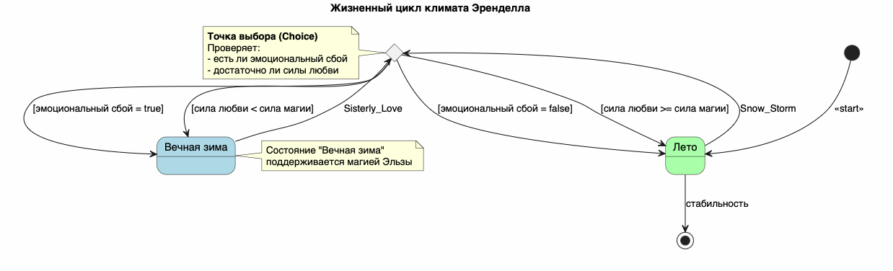

# State Diagram: Жизненный цикл системы "Холодное сердце"

## Обзор
Эта диаграмма состояний показывает жизненный цикл системы "Холодное сердце" с точки зрения управления климатом и обработки сбоев.

## Состояния
| Состояние        | Описание                                  | Цвет фона |
|------------------|-------------------------------------------|-----------|
| Лето             | Нормальное состояние системы              | Lightgreen|
| Вечная зима      | Система в состоянии сбоя                  | Lightblue |

## Переходы состояний

### Начальное состояние
- [*] --> Лето : <<start>>

### Переход: Snow_Storm
- Из Лето в точку выбора (c)

### Логика точки выбора (1)
| Условие                      | Следующее состояние |
|------------------------------|---------------------|
| эмоциональный сбой = true    | Вечная зима         |
| эмоциональный сбой = false   | Лето                |

### Переход: Sisterly_Love
- Из Вечная зима в точку выбора (c)

### Логика точки выбора (2)
| Условие                              | Следующее состояние |
|--------------------------------------|---------------------|
| сила любви >= сила магии             | Лето                |
| сила любви < сила магии              | Вечная зима         |

### Конечное состояние
- Лето --> [*] : стабильность

## Ключевые моменты
- **Точка выбора (c)**: Проверяет два условия:
  - наличие эмоционального сбоя
  - достаточность силы любви
- **Эмоциональный сбой** переводит систему из состояния "Лето" в "Вечная зима"
- **Сила любви** — единственный механизм возврата системы к нормальному состоянию
- Если сила любви недостаточна — система остаётся в состоянии "Вечная зима"

## Диаграмма


```plantuml
@startuml
skinparam state {
  BackgroundColor<<Winter>> #ADD8E6
  BackgroundColor<<Summer>> #A9FFA9
}

title Жизненный цикл климата Эренделла

[*] --> Лето : <<start>>

state "Лето" as Лето <<Summer>>
state "Вечная зима" as Зима <<Winter>>
state c <<choice>>

' Переход к точке выбора при событии
Лето --> c : Snow_Storm

' Логика переходов
c --> Зима : [эмоциональный сбой = true]
c --> Лето : [эмоциональный сбой = false]

' Попытка вернуть лето
Зима --> c : Sisterly_Love

c --> Лето : [сила любви >= сила магии]
c --> Зима : [сила любви < сила магии]

' Финал
Лето --> [*] : стабильность

note left of c
  **Точка выбора (Choice)**
  Проверяет:
  - есть ли эмоциональный сбой
  - достаточно ли силы любви
end note

note right of Зима
  Состояние "Вечная зима"
  поддерживается магией Эльзы
end note

@enduml