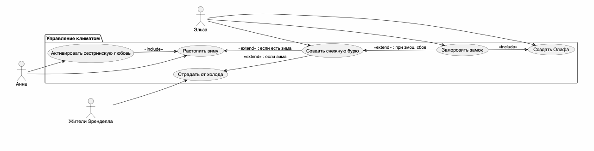

# Use Case Diagram: Система "Холодное сердце"

## Обзор
Эта диаграмма вариантов использования показывает взаимодействие актёров с системой "Холодное сердце" с точки зрения управления климатом и магией.

## Актеры
| Актер | Описание                                            |
|-------|-----------------------------------------------------|
| Эльза | Управляет магией льда и изменяет состояние климата  |
| Анна  | Пытается восстановить систему через силу любви      |
| Жители Эренделла | Испытывают последствия изменения климата |

## Варианты использования
| Use Case | Описание                                            |
|----------|-----------------------------------------------------|
| Создать снежную бурю | Инициализация зимнего состояния системы |
| Заморозить замок | Применение магии к объектам |
| Создать Олафа | Создание живого ледяного объекта |
| Страдать от холода | Реакция жителей на зиму |
| Активировать сестринскую любовь | Попытка остановить зиму |
| Растопить зиму | Возврат системы к нормальному состоянию |

## Связи
- **Эльза → Создать снежную бурю, Заморозить замок, Создать Олафа**  
- **Анна → Активировать сестринскую любовь, Растопить зиму**  
- **Жители → Страдать от холода**

### Зависимости
- **Заморозить замок <<extend>> Создать снежную бурю** (при эмоциональном сбое)  
- **Заморозить замок <<include>> Создать Олафа**  
- **Страдать от холода <<extend>> Создать снежную бурю** (если наступила зима)  
- **Активировать сестринскую любовь <<include>> Растопить зиму**  
- **Растопить зиму <<extend>> Создать снежную бурю** (если зима активна)  

## Ключевые моменты
- **Эльза** — основной актёр, инициирующий изменение состояния системы  
- **Анна** — единственный актёр, способный восстановить систему  
- **Жители** — пассивные участники, зависящие от состояния климата  
- Большинство процессов зависят от состояния "снежной бури"  
- Восстановление возможно только через цепочку действий Анны  

## Диаграмма


```plantuml
@startuml
left to right direction

actor "Эльза" as Elsa
actor "Анна" as Anna
actor "Жители Эренделла" as Citizens

package "Управление климатом" {
  usecase "Создать снежную бурю" as SnowStorm
  usecase "Заморозить замок" as FreezeCastle
  usecase "Создать Олафа" as CreateOlaf
  usecase "Страдать от холода" as Suffer
  usecase "Активировать сестринскую любовь" as SisterLove
  usecase "Растопить зиму" as MeltWinter
}

' Эльза управляет льдом
Elsa --> SnowStorm
Elsa --> FreezeCastle
Elsa --> CreateOlaf

' Жители страдают от зимы
Citizens --> Suffer

' Анна спасает ситуацию
Anna --> SisterLove
Anna --> MeltWinter

' Зависимости внутри системы
SnowStorm <.. FreezeCastle : <<extend>> : при эмоц. сбое
FreezeCastle ..> CreateOlaf : <<include>>

Suffer <.. SnowStorm : <<extend>> : если зима

SisterLove ..> MeltWinter : <<include>>
MeltWinter <.. SnowStorm : <<extend>> : если есть зима

@enduml